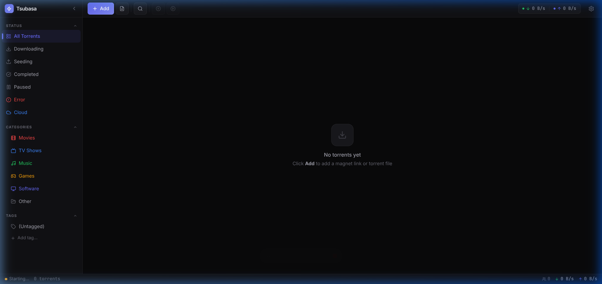

# Tsubasa

A modern, cross-platform BitTorrent client built with Tauri, React, and Rust. It integrates with cloud debrid services (Torbox, Real-Debrid) to provide instant cached downloads alongside standard peer-to-peer torrenting.

---

## Screenshots



*The main window with the collapsible sidebar (Status / Categories / Tags), the toolbar with speed indicators, and the torrent table.*

---

## Features

### Core Torrenting
- Add torrents via magnet links or .torrent files
- Pause, resume, and remove individual torrents or all at once
- Real-time download and upload speed monitoring
- Detailed per-torrent view: files, peers, trackers, and progress
- Persistent torrent state across restarts

### Sidebar Sections
- **Status** – filter by downloading, seeding, completed, paused, or errored
- **Categories** – automatically classifies torrents by name (Movies, TV Shows, Music, Games, Software)
- **Tags** – create your own labels and assign them to torrents
- **Trackers** – group torrents by their tracker host

### Cloud Integration
- Integrates with [Torbox](https://torbox.app) and [Real-Debrid](https://real-debrid.com)
- Checks instant availability (cache status) before downloading
- Routes torrents directly through the debrid service for fast, seedbox-like speeds
- Handles duplicate submissions gracefully — reuses existing cloud torrent IDs
- Download-link generation for completed cloud torrents

### Interface
- Three themes: Deep Black, Rose Pine, Clean White
- Collapsible sidebar with animated transitions
- Context menu for per-torrent operations
- Toast notifications for important events
- Detail panel with tabbed views (General, Files, Peers, Trackers, Cloud)
- Settings panel for bandwidth limits, queue limits, and provider API keys

---

## Technology Stack

| Layer | Technology |
|-------|-----------|
| Desktop shell | Tauri v2 |
| Frontend | React 19 + TypeScript |
| Styling | Tailwind CSS v4 |
| BitTorrent engine | librqbit 8.1.1 (via Rust) |
| State management | Zustand |
| Animations | Framer Motion |
| Database | SQLite (via rusqlite) |
| Icons | Lucide React |

---

## Getting Started

### Requirements

- [Node.js](https://nodejs.org) 20 or newer
- [Rust](https://www.rust-lang.org/tools/install) 1.78 or newer (with `cargo` in PATH)
- [Tauri CLI prerequisites](https://tauri.app/start/prerequisites/) for your OS

### Installation

Clone the repository and install dependencies:

```bash
git clone https://github.com/vinayydv3695/Tsubasa-.git
cd Tsubasa-
npm install
```

### Running in Development

```bash
npm run tauri dev
```

This starts the Vite dev server and launches the native desktop window. The Rust backend is compiled automatically on first run — this may take a few minutes.

### Building for Production

```bash
npm run tauri build
```

The packaged installer is written to `src-tauri/target/release/bundle/`.

---

## Configuration

### Download Location

Open **Settings > General** and set your preferred download directory.

### Cloud Providers

To enable instant cached downloads:

1. Open **Settings > Cloud**
2. Paste your API key for Torbox and/or Real-Debrid
3. Click Save

Once configured, open a torrent's detail panel and switch to the **Cloud** tab to check cache availability and submit the torrent to your provider.

### Themes

Open **Settings > Appearance** to switch between Deep Black, Rose Pine, and Clean White. The change applies instantly.

---

## Project Structure

```
Tsubasa-/
  src/                  React frontend
    components/         UI components (Sidebar, Toolbar, TorrentTable, etc.)
    stores/             Zustand state stores
    lib/                Tauri IPC bridge and utilities
    types/              Shared TypeScript type definitions
    styles/             Global CSS with design tokens
  src-tauri/
    src/
      cloud/            Cloud provider implementations (Torbox, Real-Debrid)
      commands/         Tauri IPC command handlers
      engine/           librqbit torrent engine wrapper
      storage/          SQLite database layer
      download/         Download orchestrator and state machine
      events/           Application event bus
    Cargo.toml
    tauri.conf.json
```

---

## License

MIT — see [LICENSE](LICENSE) for details.
